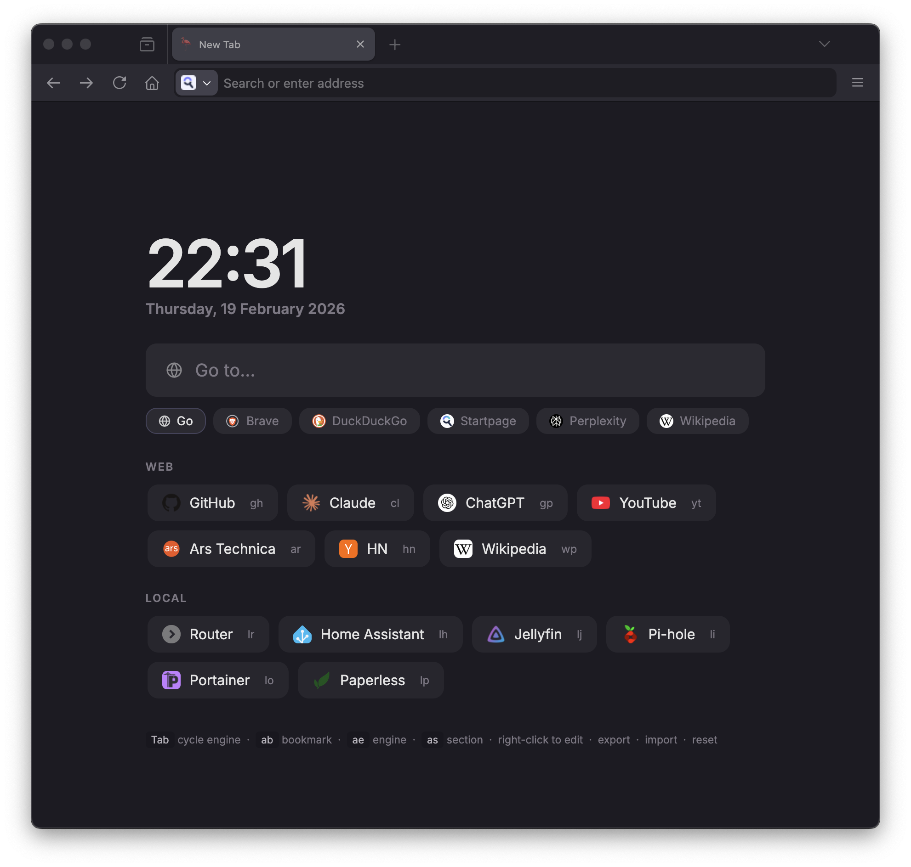

# startpage

Browser startpage, for my personal use. Single self-contained HTML file.

Vibe coded with [Claude](https://claude.ai). Inspired by [hel1mo/startpage](https://hel1mo.github.io/startpage).

---

## what it does

- **clock & date** — 24h
- **search** — `Enter` to focus, `Tab` / `Shift+Tab` to cycle engines, `Esc` to clear, auto-detects URLs vs queries
- **chord navigation** — press two keys in sequence (e.g. `gh`) to jump to any bookmark
- **draggable everything** — bookmarks, engines, and sections reorder by drag
- **right-click to edit or remove** — bookmarks, engines, and section labels
- **favicons** — DuckDuckGo service with deterministic animal emoji fallback (no broken icons)
- **export / import** — full state as JSON; edit offline and reimport to apply changes
- **localStorage persistence** — all state survives reloads

---

## how to use it

Everything is editable in-browser: right-click any bookmark, engine, or section label to edit or remove it. Use the chords below to add new items.

| key | action |
|-----|--------|
| `Enter` | focus search |
| `Tab` / `Shift+Tab` | cycle engine |
| `Enter` | search / navigate |
| `Esc` | clear search |
| `ab` | add bookmark |
| `ae` | add engine |
| `as` | add section |

To edit in bulk or back up your setup, use **export** to download a `startpage.json`, edit it, then **import** to reload. **Reset** clears everything back to the hardcoded defaults.
